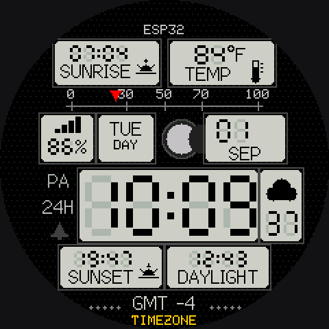
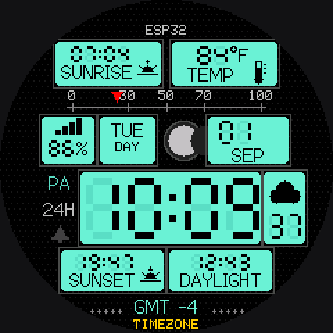
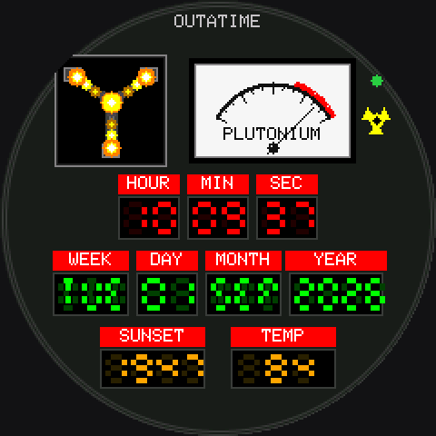
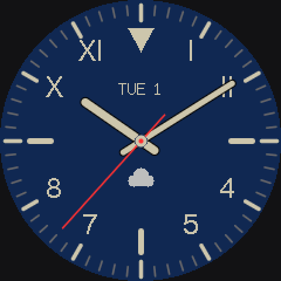
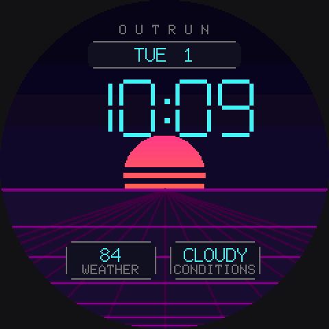
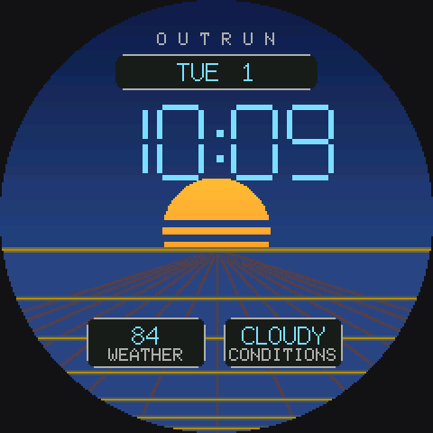
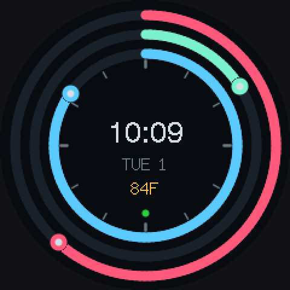
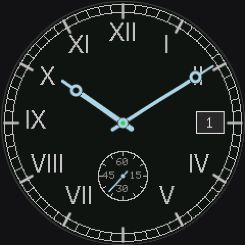
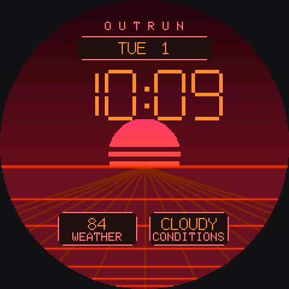

# A watch-face clock for the ESP32

An NTP clock with weather and sixteen watch faces, for a small round display.
It picks a different face every few hours. Runs on three boards: a
touchscreen AMOLED with alarms and a speaker, or a plain round LCD wired to
an ESP32-S3 or C3.

| | | | |
|:-:|:-:|:-:|:-:|
|  |  |  |  |
| word | casio | mosaic | retro |
|  |  |  |  |
| dotmatrix | pulsar | pcb | default |
|  |  |  |  |
| classic | modern | panel | panel, after sunset |
|  |  |  |  |
| delorean | california | outrun, at night | outrun, by day |
|  |  |  |  |
| orbit | casio, after sunset | retro, after sunset | classic, after sunset |
|  | | | |
| outrun, at dusk | | | |

## Get one running

**[→ Put the clock on a board](docs/flashing.md)** - download the flasher,
plug in over USB, press the button. No toolchain, nothing to compile.

Then join the **Clock-Setup** hotspot it opens, and tell it your WiFi and
roughly where you are. That is the whole setup; there is no timezone to
choose and no account to make.

## What you need

| | |
|---|---|
| **Easiest** | [Waveshare ESP32-C6 1.43" AMOLED](https://www.waveshare.com/esp32-c6-lcd-1.47.htm) - screen, touch, speaker and battery on one board, nothing to wire |
| **Cheapest** | An ESP32-S3 or C3 Super Mini and a GC9A01 round LCD, seven wires between them |

Full details, including the wiring, are in
**[docs/hardware.md](docs/hardware.md)**.

## The rest

- **[Flashing and first-time setup](docs/flashing.md)**
- **[Hardware and wiring](docs/hardware.md)**
- **[The faces](docs/faces.md)** - what each one shows, and how the themed
  ones change at sunset
- **[Alarms](docs/alarms.md)** - the touchscreen board only
- **[Building from source](docs/building.md)** - only if you want to change
  something

## Credits

[TFT_eSPI](https://github.com/Bodmer/TFT_eSPI) for the display driver and the
fonts, [ArduinoJson](https://arduinojson.org/) for parsing the weather, and
[Open-Meteo](https://open-meteo.com/) for the weather itself.
