# Round LCD clock for the ESP32 Super Mini

An NTP clock with weather on a 1.28" round GC9A01 display, with ten watch
faces. It picks a different one at random every few hours. Builds for both the ESP32-S3 and ESP32-C3
Super Mini boards from the same source.

| | | | |
|:-:|:-:|:-:|:-:|
| 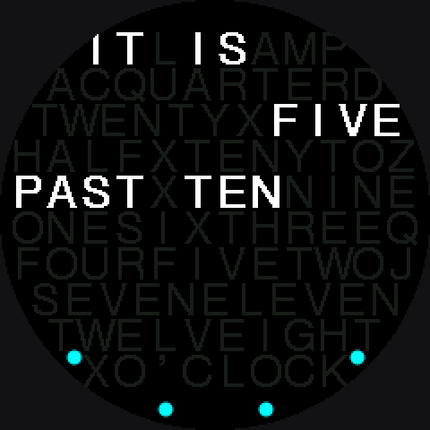 | 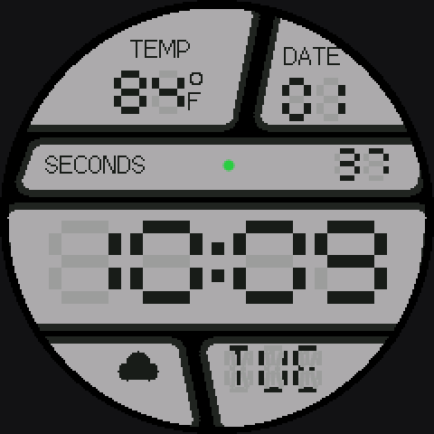 | 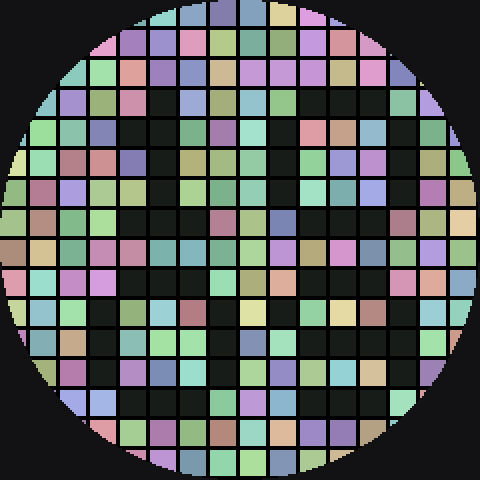 | 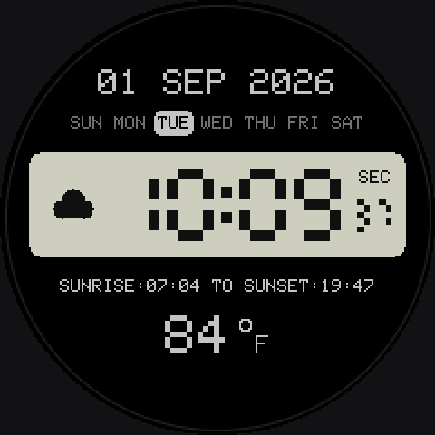 |
| word | casio | mosaic | retro |
| 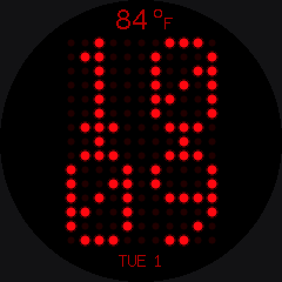 | 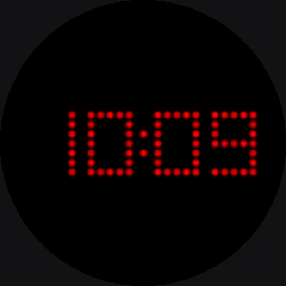 | 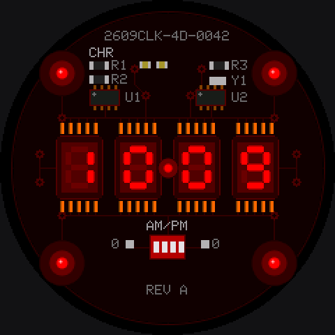 | 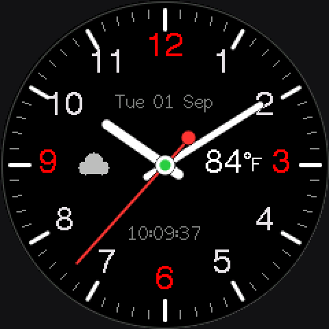 |
| dotmatrix | pulsar | pcb | default |
| 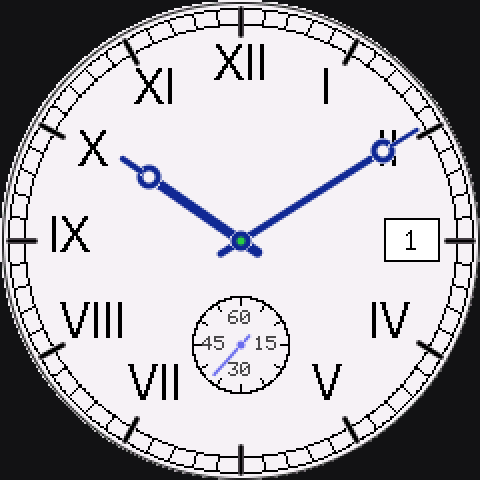 | 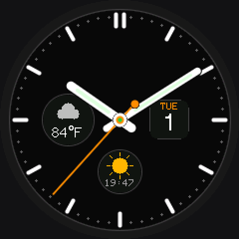 | 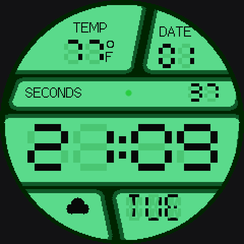 | 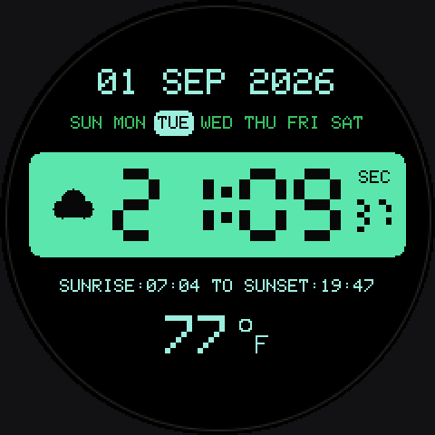 |
| classic | modern | casio, after sunset | retro, after sunset |

The casio and retro faces switch to an EL-backlight green after sunset, and
the mosaic tiles drift into blues. Sunrise and sunset come from the weather
feed, so the switch happens at the real time for wherever you've set the
coordinates.

These images are rendered from the face code with a small Python script
(`tools/render/`), using the font tables out of TFT_eSPI, so the type is the
same as what's on the panel. The drawing is re-implemented though, so treat
them as a close preview rather than a screenshot.

## Hardware

- ESP32-S3 Super Mini **or** ESP32-C3 Super Mini. Both have 4 MB flash and
  native USB, and both are supported here. The C3 has no FPU and one core, so
  the animated faces run a little slower on it, but it's fine.
- GC9A01 1.28" 240x240 round LCD, the 7-pin one (VCC GND SCL SDA DC CS RST).
  There's no backlight pin on this variant; it's always lit. If yours has a
  BLK pin, wire it to 3V3 or add `-D TFT_BL=<gpio>` to `platformio.ini`.
- A USB-C cable. That's it, the board powers the display.

## Wiring

| display | ESP32-S3 | ESP32-C3 |
|---|---|---|
| VCC | 3V3 | 3V3 |
| GND | GND | GND |
| SCL | GPIO 12 | GPIO 6 |
| SDA | GPIO 11 | GPIO 7 |
| CS | GPIO 10 | GPIO 10 |
| DC | GPIO 13 | GPIO 5 |
| RST | GPIO 9 | GPIO 4 |

On the C3, ignore the SCK/MOSI/SS labels printed on the board. Those are the
Arduino defaults and go through the GPIO matrix, which tops out around 40 MHz,
right where this runs. GPIO 6/7/10 are the chip's native SPI pins.

3V3, not 5V, for the panel.

## Building and flashing

You need [PlatformIO](https://platformio.org/) (the CLI or the VS Code
extension). Then:

```
pio run -e clock -t upload                # ESP32-S3
pio run -e c3_clock -t upload             # ESP32-C3
```

There's nothing to configure before building. WiFi and location are entered
from a phone on first boot (next section). If you'd rather bake defaults in,
copy `src/config.example.h` to `src/config.h`; it's gitignored so a password
never ends up in the repo.

## First boot: WiFi setup

With nothing saved, the clock opens a hotspot called **Clock-Setup** and the
screen tells you so. Join it from a phone and the setup page pops up on its
own (if it doesn't, open `192.168.4.1`). Pick your network from the list,
type the password, put in a ZIP or town name for the weather, choose °F or
°C, and save. The clock tries the network with the hotspot still up so the
phone is told whether it worked, then closes the hotspot and carries on.

The location is looked up once through Open-Meteo's geocoder, which also
returns the timezone, so there's no timezone to set. Common zones get their
proper daylight-saving rules; anywhere else uses the UTC offset the weather
feed reports, refreshed every ten minutes.

To change any of it later, hold the **BOOT** button while powering on for
three seconds. That wipes the saved settings and opens the hotspot again. It
also reopens by itself, with the clock still running, if the network is gone
for more than a minute.

Everything is stored in the chip's flash, so it survives reflashing the app
unless you erase the whole chip.

Every build also drops a merged image (bootloader, partition table and app in
one file, flashed at offset 0) into `firmware/<board>/`, and `flash.py` will
put it on a board and read it back to make sure it actually landed:

```
python scripts/flash.py s3 clock
python scripts/flash.py c3 clock COM8
```

It works out which chip is on which port, since both boards show up with the
same USB VID/PID and port order tells you nothing.

The clock images aren't in the repo, because anyone building with a
`config.h` would have their WiFi password compiled into them, so they're
gitignored. The only prebuilt images checked in are the `displaytest` ones,
which have no WiFi in them at all. They're handy for checking the wiring
before you've set anything up:

```
python scripts/flash.py c3 displaytest
```

### If the screen stays black

Backlight on, nothing drawn, no error anywhere. This is almost always one of
two things:

**The pin map.** Check SCL and SDA against the table above, particularly on
the C3 where the silkscreen is misleading. Flash `displaytest` (or
`c3_displaytest`) to get a colour cycle with no WiFi involved:

```
pio run -e c3_displaytest -t upload
```

**TFT_eSPI's SPI port.** The library picks the wrong SPI base address on both
of these chips by default, in different ways, and the result is that every
register write goes to address 0. On the S3 the fix is `-D USE_HSPI_PORT`,
which `platformio.ini` already sets. On the C3 the port is hardcoded inside
the library and can't be overridden with a flag, so `scripts/patch_tft_c3.py`
patches the header at build time. Both are already wired up; this is just so
you know what they're for if you touch the build config.

### Serial output

There isn't any over USB. USB CDC is turned off (`ARDUINO_USB_CDC_ON_BOOT=0`)
because with nothing draining it, `Serial.print` would stall the render loop,
and it kept wedging the esptool reset handshake. Flashing still works since
that's handled by the USB-JTAG hardware. If you want logs, put a USB-UART
adapter on the UART0 pins.

The faces show what you'd otherwise want a serial console for: the hub dot
(analog) or the dot in the seconds band (casio) is green once WiFi and NTP
are both up, and the casio face shows `TEMP E<n>` if the weather fetch fails,
where n is which step failed (6 means the location couldn't be found; try a
town name instead of a postcode).

## The faces

All ten are compiled into one binary. Every three hours the clock switches
to a different face picked at random, never the one already showing, and it
starts on a random one at boot. The interval is `ROTATE_MS` at the top of
`src/main.cpp`; set it to 0 to stay on one face, or set `ROTATE_RANDOM` to
false to go through `ROTATION[]` in order instead.

To look at one face without waiting for the rotation to reach it, build a
preview pinned to it. The preview envs skip the `firmware/` export so they
can't be mistaken for a release image:

```
PREVIEW_FACE=FACE_PCB pio run -e c3_preview -t upload
```

On PowerShell that's `$env:PREVIEW_FACE="FACE_PCB"; pio run -e c3_preview -t upload`.
Use `preview` instead of `c3_preview` for the S3.

- **word** - the QLOCKTWO-style letter grid. Five-minute resolution, with
  four dots around the bottom rim for the remaining minutes. The grid is
  shaped to the circle, so rows get shorter toward the top and bottom.
- **casio** - angled panels like a dive watch LCD, with ghosted unlit
  segments. Day of week is 14-segment so M and W render properly.
- **mosaic** - a grid of pastel tiles that slowly drift in hue and breathe in
  brightness, with the time as dark tiles in the middle.
- **retro** - green LCD strip with a week row above and sunrise/sunset below.
  Grey by day, glows green at night.
- **dotmatrix** - a 70s red LED array. The unlit dots stay faintly visible,
  which is what makes it look like a real one.
- **pulsar** - the other 70s LED watch, the Pulsar P2 / Kingsonic type. Each
  segment is a row of tiny discrete LEDs with a soft halo rather than a solid
  bar, the digits are small in a big black window, and there's nothing else
  on the face. Leading zero blanked below ten, colon blinks.
- **pcb** - a bare circuit board under red glass with four DIP seven-segment
  LED modules soldered across it. Pins, bubble lenses with the segment
  shadows showing, SMD parts with their reference designators, traces and
  vias, a DIP switch marked AM/PM, and four corner LEDs lighting the board.
  The detail is the point; strip it back and it becomes an icon.
- **default** - plain analog with a sweeping second hand and the weather
  beside the 9 and 3.
- **classic** - ivory dress dial. Railroad minute track, upright Roman
  numerals, a framed date window at 3 in place of the III, small seconds at 6
  in place of the VI, and blued Breguet hands with the hollow moon near the
  tip. No centre seconds hand; the seconds live in the sub-dial.
- **modern** - charcoal sports dial with baton indices, broad lumed hands and
  an orange centre seconds. Weather in a sub-dial at 9, the date in a tile at
  3 with the weekday over it, and at 6 a sun or moon for the time of day with
  the next sunrise or sunset time under it.

All the digital ones are 24-hour.

Adding a face: copy one of the existing `src/faces/face_*.cpp`, keep it in
its own namespace, export a `FaceVTable`, and add it to `ROTATION[]`. Nothing
else needs to change. Each face is a few KB; linking all ten costs about 2 KB
over a single one because everything else is shared.

## Weather

From [Open-Meteo](https://open-meteo.com/), which doesn't need an API key.
Temperature, condition code, day/night and today's sunrise and sunset, fetched
every ten minutes over plain HTTP. The same service's geocoder turns the
ZIP or town from setup into coordinates and a timezone. HTTPS was dropped on purpose: the TLS
handshake wanted ~40 KB on top of the 115 KB frame buffer and was failing to
allocate, and the endpoint is fine over HTTP.

On the S3 the fetch runs on the second core so it never interrupts rendering.
On the C3 there's only one core, so there's a short hitch every ten minutes.

## Layout

```
src/
  main.cpp             hardware, WiFi, NTP, weather, face rotation
  portal.cpp           the Clock-Setup hotspot and its page
  settings.cpp         what setup saved, in NVS
  tz.h                 IANA zone name -> POSIX rule
  face.h               face interface, shared weather icons, day/night
  config.example.h     optional compiled-in defaults
  faces/               one file per face
  tools/display_test.cpp
firmware/s3, firmware/c3   prebuilt images
scripts/
  flash.py             flash a prebuilt image and verify it
  export_firmware.py   post-build hook that produces the merged images
  patch_tft_c3.py      the TFT_eSPI fix for the C3
tools/render/          renders the preview images in docs/faces
docs/faces/            the images above
```

## Credits

[TFT_eSPI](https://github.com/Bodmer/TFT_eSPI) for the display driver and the
fonts, [ArduinoJson](https://arduinojson.org/) for parsing the weather, and
[Open-Meteo](https://open-meteo.com/) for the weather itself.
